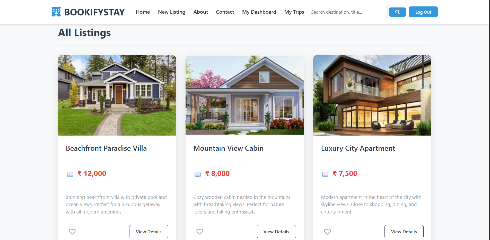
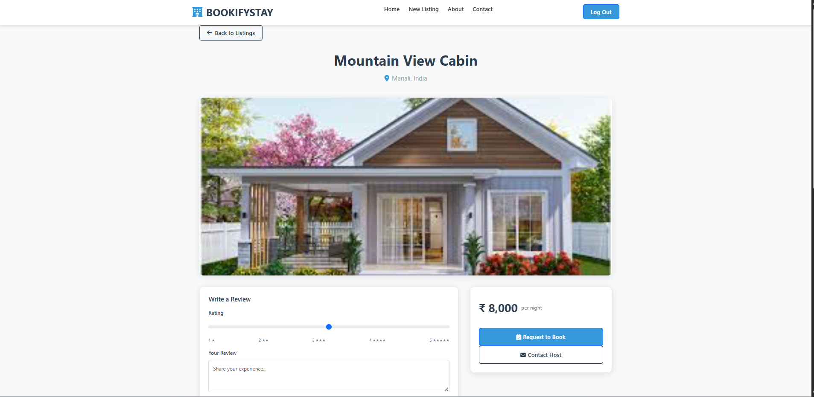

# BOOKIFYSTAY 🏨

A full-stack, dynamic property booking marketplace that connects hosts with travelers looking for their next great stay. 

## 📸 Project Previews

*Above: The main marketplace where users can browse available properties.*

*Above: A detailed view of a listing where users can request a booking.*

## 🚀 Features
* **User Authentication & Security:** Secure sign-up and login with password hashing, session management, and mandatory account email verification powered by the **Brevo API**.
* **Property Management:** Users can easily create, edit, and manage their own property listings.
* **Cloud Image Uploads:** Seamless, high-performance image hosting and management integrated directly with **Cloudinary**.
* **Booking System:** Integrated request system allowing hosts to review, accept, or reject booking dates with automated email notifications.
* **Functional Review System:** Guests can leave ratings and detailed reviews for properties, helping build trust and engagement within the community.
* **Responsive Design:** Fully responsive UI that works seamlessly on both desktop and mobile devices.

## 🛠️ Tech Stack
* **Frontend:** HTML5, CSS3, Bootstrap 5, EJS (Embedded JavaScript Templating)
* **Backend:** Node.js, Express.js
* **Database:** MongoDB Atlas, Mongoose
* **Authentication:** Passport.js, Express-Session
* **APIs & Services:** Cloudinary (Image Storage), Brevo API (Transactional Emails)
* **Deployment:** Render (Hosting)

## 👨‍💻 Author
**Vardan Singh**
* GitHub: [@vardan-18](https://github.com/vardan-18)